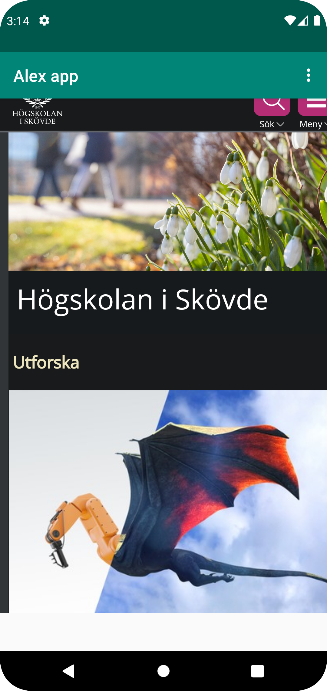
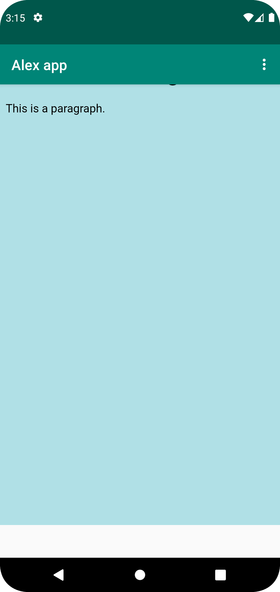

# Rapport

Jag har ändrat namn på appen och ändrat om den tidigare textviewn till en webview samt tillåtit internettillgång så att webviewern kan visa hemsidor (his.se). Jag har genom getSettings() tillåtit Javascript och efter det även skapat en assets directory där jag även skapade en html-fil som jag ändrat bakgrundsfärgen och lite text i. Sedan har lagt till Högskolan i Skövdes startsida som extern visningssida och html-filen about som intern sida och tillåtit appens dropdown-alternativsknappar att visa dem när man trycker där.

```
        myWebView = findViewById(R.id.my_webview);
        myWebView.setWebViewClient(new WebViewClient()); // Do not open in Chrome!
        myWebView.loadUrl("https://his.se");
        myWebView.getSettings().setJavaScriptEnabled(true);
```
I metoden onCreate gör jag en ny myWebView som använder ID:n my_webview och tillsätter en WebViewClient som sedan öppnar Url:n 'his.se' när jag startar appen. 
För att hemsidan ska fungera korrekt tillåter jag även JavaScript.



